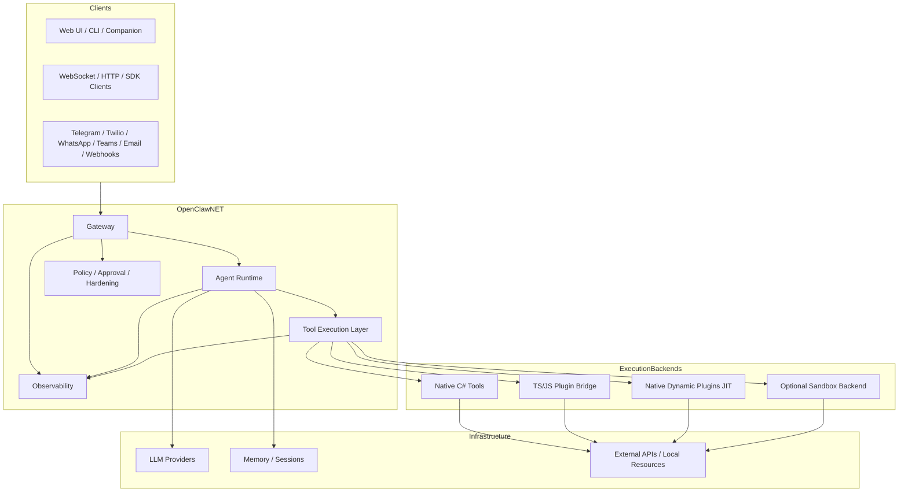
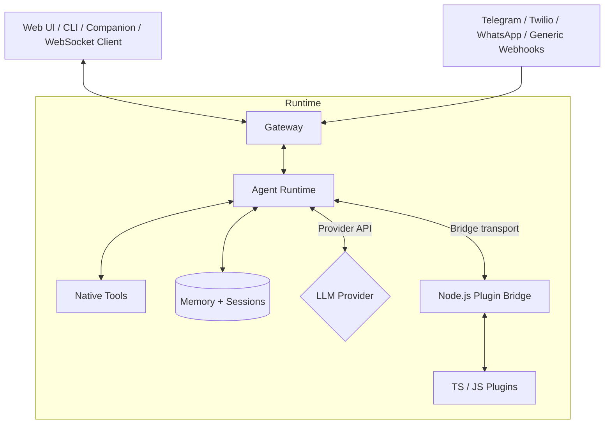

<div align="center">
  
</div>

# OpenClaw.NET

[](https://opensource.org/licenses/MIT)


> **Disclaimer**: This project is not affiliated with, endorsed by, or associated with [OpenClaw](https://github.com/openclaw/openclaw). It is an independent .NET implementation inspired by their work.

Self-hosted **AI agent runtime and gateway for .NET** with a NativeAOT-friendly `aot` lane, an expanded `jit` compatibility lane, explicit tool execution, practical OpenClaw ecosystem compatibility, observability, and security hardening controls.

## Why This Project Exists

Most agent stacks assume Python- or Node-first runtimes. That works until you want to keep the rest of your system in .NET, publish lean self-contained binaries, or reuse existing tools and plugins without rebuilding your runtime around another language stack.

OpenClaw.NET takes a different path:

- **NativeAOT-friendly runtime and gateway** for .NET agent workloads
- **Practical reuse of existing OpenClaw TS/JS plugins and `SKILL.md` packages**
- A real **tool execution layer** with approval hooks, timeout handling, usage tracking, and optional sandbox routing
- Explicit **compatibility boundaries by runtime mode** instead of vague parity claims
- A foundation for experimenting with **production-oriented agent infrastructure in .NET**

The goal is to explore what a dependable runtime and gateway layer for AI agents can look like in the .NET ecosystem.

If this repo is useful to you, please star it.

## What It Does Today

- A multi-step **agent runtime** with tool calling, retries, per-call timeouts, streaming, circuit-breaker behavior, context compaction, and optional parallel tool execution
- A dedicated **tool execution layer** with approval flows, hooks, usage tracking, deterministic failure handling, and sandbox routing
- **Skills**, memory-backed sessions, memory recall injection, project memory, delegated sub-agents, session search, user profiles, and session-scoped todo state
- A review-first **self-evolving loop** with learning proposals, profile updates, managed skill drafts, and automation suggestions that require explicit approval before activation
- A **gateway layer** for browser UI, live webchat, WebSocket, OpenAI-compatible endpoints, a typed integration API, MCP, webhooks, auth, rate limits, and observability
- Native **multimodal and realtime** capabilities including vision analysis, text-to-speech, provider-routed live sessions, and browser/CLI/TUI live clients
- Built-in and webhook-driven **channel adapters** for Telegram, Twilio SMS, WhatsApp, Teams, Slack, Discord, Signal, email, and generic webhooks
- Practical **OpenClaw ecosystem** compatibility: JS/TS bridge plugins, standalone `SKILL.md` packages, and native dynamic plugins in `jit`
- Two runtime lanes (**`aot`** and **`jit`**) plus an optional **MAF orchestrator** in MAF-enabled artifacts

## Architecture



The gateway sits between clients, models, tools, and infrastructure, handling agent execution, tool routing, security/hardening, compatibility diagnostics, and observability.

### Startup flow

1. **`Bootstrap/`** — Loads config, resolves runtime mode and orchestrator, applies validation and hardening, handles early exits (`--doctor`).
2. **`Composition/` and `Profiles/`** — Registers services and applies the effective runtime lane (`aot` or `jit`).
3. **`Pipeline/` and `Endpoints/`** — Wires middleware, channel startup, workers, shutdown handling, and HTTP/WebSocket surfaces.

### Runtime flow



### Runtime modes

| Mode | Description |
|------|-------------|
| `aot` | Trim-safe, low-memory lane |
| `jit` | Expanded bridge surfaces + native dynamic plugins |
| `auto` | Selects `jit` when dynamic code is available, `aot` otherwise |

For the full startup-module breakdown, see [docs/architecture-startup-refactor.md](docs/architecture-startup-refactor.md).

## Quickstart

```bash
git clone https://github.com/clawdotnet/openclaw.net
cd openclaw.net

export MODEL_PROVIDER_KEY="your-api-key"

# Validate config (optional)
dotnet run --project src/OpenClaw.Gateway -c Release -- --doctor

# Start the gateway
dotnet run --project src/OpenClaw.Gateway -c Release
```

Then open one of:

| Surface | URL |
|---------|-----|
| Web UI / Live Chat | `http://127.0.0.1:18789/chat` |
| WebSocket | `ws://127.0.0.1:18789/ws` |
| Live WebSocket | `ws://127.0.0.1:18789/ws/live` |
| Integration API | `http://127.0.0.1:18789/api/integration/status` |
| MCP endpoint | `http://127.0.0.1:18789/mcp` |
| OpenAI-compatible | `http://127.0.0.1:18789/v1/responses` |

**Optional environment variables:**

| Variable | Default | Purpose |
|----------|---------|---------|
| `OPENCLAW_WORKSPACE` | — | Workspace directory for file tools |
| `OpenClaw__Runtime__Mode` | `auto` | Runtime lane (`aot`, `jit`, or `auto`) |
| `OPENCLAW_BASE_URL` | `http://127.0.0.1:18789` | CLI base URL |
| `OPENCLAW_AUTH_TOKEN` | — | Auth token (required for non-loopback) |

**Other entry points:**

```bash
# CLI chat
dotnet run --project src/OpenClaw.Cli -c Release -- chat

# CLI live session
dotnet run --project src/OpenClaw.Cli -c Release -- live --provider gemini

# One-shot CLI run
dotnet run --project src/OpenClaw.Cli -c Release -- run "summarize this README" --file ./README.md

# Desktop companion (Avalonia)
dotnet run --project src/OpenClaw.Companion -c Release

# Admin commands
dotnet run --project src/OpenClaw.Cli -c Release -- admin posture
dotnet run --project src/OpenClaw.Cli -c Release -- admin approvals simulate --tool shell --sender user1 --approval-tool shell
dotnet run --project src/OpenClaw.Cli -c Release -- admin incident export
```

See the full [Quickstart Guide](docs/QUICKSTART.md) for runtime mode selection and deployment notes.

## Ecosystem Compatibility

OpenClaw.NET targets **practical compatibility**, especially around the mainstream tool and skill path. Compatibility is mode-specific and intentionally explicit.

| Surface | `aot` | `jit` | Notes |
| --- | --- | --- | --- |
| Standalone `SKILL.md` packages | yes | yes | Native skill loading; no JS bridge required. |
| `api.registerTool()` / `api.registerService()` | yes | yes | Core bridge path supported in both lanes. |
| `api.registerChannel()` / `registerCommand()` / `registerProvider()` / `api.on(...)` | — | yes | Dynamic plugin surfaces are JIT-only. |
| Standalone `.js` / `.mjs` / `.ts` plugins | yes | yes | `.ts` plugins require `jiti`. |
| Native dynamic .NET plugins | — | yes | Enabled through `OpenClaw:Plugins:DynamicNative`. |
| Unsupported bridge surfaces | fail fast | fail fast | Explicit diagnostics instead of partial load. |

Pinned public smoke coverage includes `peekaboo`, `@agentseo/openclaw-plugin`, and `openclaw-tavily`, plus expected-fail cases such as `@supermemory/openclaw-supermemory`.

For the detailed matrix, see [Plugin Compatibility Guide](docs/COMPATIBILITY.md).

## Typed Integration API and MCP

The gateway exposes three complementary remote surfaces:

| Surface | Path | Purpose |
|---------|------|---------|
| OpenAI-compatible | `/v1/*` | Drop-in for OpenAI clients |
| Typed integration API | `/api/integration/*` | Status, dashboard, approvals, providers, plugins, sessions, events, message enqueueing |
| MCP facade | `/mcp` | JSON-RPC facade (`initialize`, `tools/*`, `resources/*`, `prompts/*`) |

The shared `OpenClaw.Client` package exposes matching .NET methods for both surfaces:

```csharp
using OpenClaw.Client;

using var client = new OpenClawHttpClient("http://127.0.0.1:18789", authToken: null);

var dashboard = await client.GetIntegrationDashboardAsync(CancellationToken.None);
var statusTool = await client.CallMcpToolAsync(
    "openclaw.get_status",
    JsonDocument.Parse("{}").RootElement.Clone(),
    CancellationToken.None);
```

## Docker Deployment

```bash
export MODEL_PROVIDER_KEY="sk-..."
export OPENCLAW_AUTH_TOKEN="$(openssl rand -hex 32)"

# Gateway only
docker compose up -d openclaw

# With automatic TLS via Caddy
export OPENCLAW_DOMAIN="openclaw.example.com"
docker compose --profile with-tls up -d
```

### Build from source

```bash
docker build -t openclaw.net .
docker run -d -p 18789:18789 \
  -e MODEL_PROVIDER_KEY="sk-..." \
  -e OPENCLAW_AUTH_TOKEN="change-me" \
  -v openclaw-memory:/app/memory \
  openclaw.net
```

### Published images

Available on all three registries:

- `ghcr.io/clawdotnet/openclaw.net:latest`
- `tellikoroma/openclaw.net:latest`
- `public.ecr.aws/u6i5b9b7/openclaw.net:latest`

### Volumes

| Path | Purpose |
|------|---------|
| `/app/memory` | Session history + memory notes (persist across restarts) |
| `/app/workspace` | Mounted workspace for file tools (optional) |

See [Docker Image Notes](docs/DOCKERHUB.md) for multi-arch push commands and image details.

## Security and Hardening

When binding to a non-loopback address, the gateway **refuses to start** unless dangerous settings are explicitly hardened or opted in:

- Auth token is **required** for non-loopback binds
- Wildcard tooling roots, shell access, and plugin execution are blocked by default
- WhatsApp webhooks require signature validation
- `raw:` secret refs are rejected on public binds

**Quick checklist:**

- [ ] Set `OPENCLAW_AUTH_TOKEN` to a strong random value
- [ ] Set `MODEL_PROVIDER_KEY` via environment variable (never in config files)
- [ ] Use `appsettings.Production.json` (`AllowShell=false`, restricted roots)
- [ ] Enable TLS (reverse proxy or Kestrel HTTPS)
- [ ] Set `AllowedOrigins` if serving a web frontend
- [ ] Configure rate limits (`MaxConnectionsPerIp`, `MessagesPerMinutePerConnection`, `SessionRateLimitPerMinute`)
- [ ] Monitor `/health` and `/metrics` endpoints
- [ ] Pin a specific Docker image tag in production

See [Security Guide](SECURITY.md) for full hardening guidance and [Sandboxing Guide](docs/sandboxing.md) for sandbox routing.

## Channels

OpenClaw.NET includes channel adapters and webhook surfaces for text-first messaging across the built-in gateway. The currently implemented set spans **Telegram**, **Twilio SMS**, **WhatsApp**, **Teams**, **Slack**, **Discord**, **Signal**, **email**, and **generic webhooks**.

These adapters are policy-aware and fit into the same runtime/session pipeline, but operational maturity is not identical across all providers. Newer adapters should be treated as early support until their setup docs and test coverage catch up.

| Channel | Webhook path | Setup guide |
|---------|-------------|-------------|
| Telegram | `/telegram/inbound` | [User Guide](docs/USER_GUIDE.md) |
| Twilio SMS | `/twilio/sms/inbound` | [User Guide](docs/USER_GUIDE.md) |
| WhatsApp | configurable | [WhatsApp Setup](docs/WHATSAPP_SETUP.md) |
| Teams | `/api/messages` | [User Guide](docs/USER_GUIDE.md) |
| Slack | `/slack/events`, `/slack/commands` | Config in `Channels:Slack` |
| Discord | `/discord/interactions` | Config in `Channels:Discord` |
| Signal | adapter-driven (`signald` or `signal-cli`) | Config in `Channels:Signal` |
| Generic webhooks | `/webhooks/{name}` | [User Guide](docs/USER_GUIDE.md) |

## Learning and Automation

OpenClaw.NET now includes a review-first learning path instead of silent self-modification.

- Completed sessions and automation runs can produce **learning proposals** for managed skill drafts, user profile updates, and automation suggestions
- Learned changes are stored as **pending proposals** until an operator explicitly approves or rejects them
- The runtime can use **session search**, **profile recall**, and **automation state** directly as part of ongoing execution
- Automations are first-class objects with schedules, delivery targets, previews, run-now, pause, and resume support

## Observability

| Endpoint | Description |
|----------|-------------|
| `GET /health` | Health check (`status`, `uptime`) |
| `GET /metrics` | Runtime counters (requests, tokens, tool calls, circuit breaker, retention) |
| `GET /memory/retention/status` | Retention config + last run state |
| `POST /memory/retention/sweep` | Trigger manual retention sweep (`?dryRun=true` supported) |

All agent operations emit structured logs and `.NET Activity` traces with correlation IDs, exportable to OTLP collectors (Jaeger, Prometheus, Grafana).

## Optional Integrations

### Semantic Kernel

OpenClaw.NET can act as the **production gateway host** (auth, rate limits, channels, OTEL, policy) around your existing SK code. See [Semantic Kernel Guide](docs/SEMANTIC_KERNEL.md).

Available: `src/OpenClaw.SemanticKernelAdapter` (adapter library) and `samples/OpenClaw.SemanticKernelInteropHost` (runnable sample).

### MAF Orchestrator

Microsoft Agent Framework is supported as an optional backend in MAF-enabled build artifacts. Set `Runtime.Orchestrator=maf` (default remains `native`). See the [publish script](eng/publish-gateway-artifacts.sh) for artifact details.

### Notion Scratchpad

Optional native Notion integration for shared scratchpads and notes (`notion` / `notion_write` tools). See [Tool Guide](docs/TOOLS_GUIDE.md).

### Memory Retention

Background retention sweeper for sessions and branches (opt-in). Default TTLs: sessions 30 days, branches 14 days. See [User Guide](docs/USER_GUIDE.md).

## Docs

| Document | Description |
|----------|-------------|
| [Quickstart Guide](docs/QUICKSTART.md) | Local setup and first usage |
| [User Guide](docs/USER_GUIDE.md) | Runtime concepts, providers, tools, skills, memory, channels |
| [Tool Guide](docs/TOOLS_GUIDE.md) | Built-in tools, native integrations, approval guidance |
| [Plugin Compatibility Guide](docs/COMPATIBILITY.md) | Plugin surfaces, mode gating, failure modes |
| [Security Guide](SECURITY.md) | Hardening guidance for public deployments |
| [Sandboxing Guide](docs/sandboxing.md) | Sandbox routing, build flags, config |
| [Semantic Kernel Guide](docs/SEMANTIC_KERNEL.md) | Hosting SK tools/agents behind OpenClaw.NET |
| [WhatsApp Setup](docs/WHATSAPP_SETUP.md) | Worker setup and auth flow |
| [Docker Image Notes](docs/DOCKERHUB.md) | Container usage and image references |
| [Changelog](CHANGELOG.md) | Tracked project changes |

## CI/CD

GitHub Actions (`.github/workflows/ci.yml`):
- **On push/PR to main**: build + test standard and MAF-enabled targets
- **On push to main**: publish gateway artifacts (`standard-{jit|aot}`, `maf-enabled-{jit|aot}`), NativeAOT CLI, and Docker image to GHCR

## Contributing

Looking for:

- Security review
- NativeAOT trimming improvements
- Tool sandboxing ideas
- Performance benchmarks

If this aligns with your interests, open an issue.

If this project helps your .NET AI work, consider starring it.
