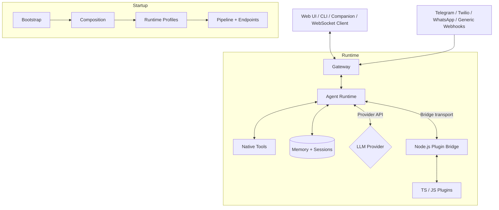

<div align="center">
  
</div>

# OpenClaw.NET

[](https://opensource.org/licenses/MIT)

> **Independent .NET implementation of the OpenClaw agent runtime and gateway, built for deployable .NET services, a strong NativeAOT lane, optional MAF orchestration in the MAF-enabled artifacts, and practical compatibility with the JavaScript plugin ecosystem.**

> **Disclaimer:** This project is not affiliated with, endorsed by, or associated with [OpenClaw](https://github.com/openclaw/openclaw). It is an independent implementation inspired by their work.

---

## Why This Project Exists

Most agent stacks still assume Python- or Node-first runtimes. That works until you want to keep the rest of your system in .NET, publish lean self-contained binaries, or reuse existing infrastructure without rebuilding your runtime assumptions around another language stack.

OpenClaw.NET takes a different path:

- .NET-first gateway and agent runtime with a real NativeAOT-friendly deployment lane
- practical reuse of OpenClaw JS/TS plugins through a JSON-RPC bridge instead of forcing rewrites
- explicit compatibility diagnostics instead of vague "mostly compatible" claims
- an optional Microsoft Agent Framework orchestrator path in the MAF-enabled artifacts while keeping the native runtime as the default
- a platform for production-oriented agent infrastructure in .NET: auth, policy, memory, channels, observability, and packaged deployment targets

If this repo is useful to you, star it.

---

## What The Codebase Includes Today

- Gateway surfaces for HTTP, WebSocket, browser UI, webhooks, and OpenAI-compatible endpoints
- Gateway-hosted typed integration API under `/api/integration/*` and a token-authenticated MCP JSON-RPC facade at `/mcp`
- Agent runtime for tools, memory, sessions, skills, policy, approvals, and message pipeline execution
- Two runtime lanes: trim-safe `aot` and broader-compatibility `jit`
- Two artifact families: standard artifacts plus MAF-enabled artifacts where `Runtime.Orchestrator=maf` is optional
- Built-in clients: browser UI at `/chat`, CLI, and Avalonia desktop companion
- Reusable library packages in-repo: `OpenClaw.Client`, `OpenClaw.Core`, `OpenClaw.PluginKit`, and `OpenClaw.SemanticKernelAdapter`
- Optional integrations for Telegram, Twilio SMS, WhatsApp, Semantic Kernel, the JS/TS plugin bridge, and the MAF adapter

## Ecosystem Compatibility

OpenClaw.NET is focused on **practical compatibility**, especially around tools, skills, and the mainstream plugin path.

| Surface | Status on `main` after this merge | Notes |
| --- | --- | --- |
| Standalone `SKILL.md` packages | Supported | Run natively; no JS bridge required. |
| JS/TS tool plugins | Supported | Run through the Node bridge. |
| Trim-safe compatibility lane | Supported in `aot` | Conservative deployment path. |
| `registerChannel()` / `registerCommand()` / `registerProvider()` / `api.on(...)` | Supported in `jit` | Dynamic plugin surfaces are intentionally JIT-only. |
| `Runtime.Orchestrator=maf` | Supported in MAF-enabled artifacts | `native` remains the default orchestrator everywhere. |
| Unsupported plugin/runtime capabilities | Rejected explicitly | The gateway fails fast with compatibility diagnostics instead of partially loading the plugin. |

The goal is not full upstream extension-host parity. The goal is a clear, dependable compatibility contract with honest failure modes.

For the exact compatibility matrix, see [COMPATIBILITY.md](COMPATIBILITY.md).

## Runtime Model

OpenClaw.NET now has two related selectors:

- `Runtime.Mode`: `aot`, `jit`, or `auto`
- `Runtime.Orchestrator`: `native` everywhere, or `maf` only in the MAF-enabled artifacts

In practice:

- `aot` keeps the trim-safe, lower-memory lane
- `jit` enables the broader dynamic/plugin compatibility lane
- `auto` chooses between `aot` and `jit` based on runtime capabilities
- `native` remains the default orchestrator even in MAF-enabled artifacts

## Optional Sandbox Execution

OpenClaw.NET can optionally route high-risk native tools through [OpenSandbox](https://github.com/AIDotNet/OpenSandbox) instead of executing them on the gateway host.

Current scope:

- `shell`
- `code_exec`
- `browser`

Key points:

- sandbox routing is enabled by default in the shipped gateway config
- the standard runtime artifact does not include the OpenSandbox integration package
- the sandbox-enabled build is produced with `-p:OpenClawEnableOpenSandbox=true`
- `Prefer` mode falls back to local execution if the provider is unavailable
- `Require` mode fails closed and is the recommended public-bind setting for `shell`
- set `OpenClaw:Sandbox:Provider=None` to force all sandbox-capable tools back to local execution

Example:

```json
"OpenClaw": {
  "Sandbox": {
    "Provider": "OpenSandbox",
    "Endpoint": "http://localhost:5000",
    "ApiKey": "env:OPEN_SANDBOX_API_KEY",
    "DefaultTTL": 300,
    "Tools": {
      "shell": {
        "Mode": "Prefer",
        "Template": "alpine:3.20",
        "TTL": 300
      },
      "code_exec": {
        "Mode": "Prefer",
        "Template": "nikolaik/python-nodejs:python3.12-nodejs22-slim",
        "TTL": 300
      },
      "browser": {
        "Mode": "Prefer",
        "Template": "mcr.microsoft.com/playwright:v1.52.0-noble",
        "TTL": 600
      }
    }
  }
}
```

These are starter image choices. For public or production deployments, promote tools like `shell` to `Require` and replace the image URIs with images you control.

See [docs/sandboxing.md](docs/sandboxing.md) for the architecture, build flag, local-switch behavior, and full config examples.

## Quick Links

- [Quickstart Guide](QUICKSTART.md)
- [User Guide](USER_GUIDE.md)
- [Tool Guide](TOOLS_GUIDE.md)
- [Security Guide](SECURITY.md)
- [Plugin Compatibility Guide](COMPATIBILITY.md)
- [Semantic Kernel Guide](SEMANTIC_KERNEL.md)
- [Sandboxing Guide](docs/sandboxing.md)
- [MAF Readiness Notes](docs/experiments/maf-aot-jit-readiness.md)
- [Startup Architecture Notes](docs/architecture-startup-refactor.md)
- [Changelog](CHANGELOG.md)
- [Docker Image Notes](DOCKERHUB.md)

Published container images:

- `ghcr.io/clawdotnet/openclaw.net:latest`
- `tellikoroma/openclaw.net:latest`
- `public.ecr.aws/u6i5b9b7/openclaw.net:latest`

## Architecture

OpenClaw.NET separates gateway startup and runtime composition into explicit layers instead of a single startup path.

Startup flow:

1. `Bootstrap/`
  - Loads config, resolves runtime mode and orchestrator, applies validation and hardening, and handles early exits such as `--doctor`.
2. `Composition/` and `Profiles/`
  - Registers services and applies the effective runtime lane: `aot` for trim-safe deployments or `jit` for expanded compatibility.
3. `Pipeline/` and `Endpoints/`
  - Wires middleware, channel startup, workers, shutdown handling, and the grouped HTTP/WebSocket surfaces.

Runtime flow:

- The Gateway handles HTTP, WebSocket, webhook, auth, policy, and observability concerns.
- The Agent Runtime owns reasoning, tool execution, memory interaction, and skill loading.
- Native tools run in-process.
- JS/TS plugins run through the Node.js bridge, with capability enforcement depending on the effective runtime lane.
- The optional MAF adapter swaps orchestration strategy inside the MAF-enabled artifacts; it does not replace the gateway/runtime ownership model.
- Pure `SKILL.md` packages remain independent of the plugin bridge.



Runtime lanes:

- `OpenClaw:Runtime:Mode="aot"` keeps the trim-safe, low-memory lane.
- `OpenClaw:Runtime:Mode="jit"` enables expanded bridge surfaces and native dynamic plugins.
- `OpenClaw:Runtime:Mode="auto"` selects `jit` when dynamic code is available and `aot` otherwise.

For the full startup-module breakdown, see [docs/architecture-startup-refactor.md](docs/architecture-startup-refactor.md).

## Quickstart (local)

See [QUICKSTART.md](QUICKSTART.md) for the fastest path from zero to a running gateway.

The shortest local path is:

1. Set your API key:
  - `export MODEL_PROVIDER_KEY="..."`
  - Optional workspace: `export OPENCLAW_WORKSPACE="$PWD/workspace"`
  - Optional runtime selection: `export OpenClaw__Runtime__Mode="jit"`
2. Run the gateway:
  - `dotnet run --project src/OpenClaw.Gateway -c Release`
  - Or validate config first: `dotnet run --project src/OpenClaw.Gateway -c Release -- --doctor`
  - Optional config file: `dotnet run --project src/OpenClaw.Gateway -c Release -- --config ~/.openclaw/config.json`
3. Use one of the built-in clients:
  - Web UI: `http://127.0.0.1:18789/chat`
  - WebSocket endpoint: `ws://127.0.0.1:18789/ws`
  - Integration status: `http://127.0.0.1:18789/api/integration/status`
  - MCP endpoint: `http://127.0.0.1:18789/mcp`
  - CLI: `dotnet run --project src/OpenClaw.Cli -c Release -- chat`
  - Companion app: `dotnet run --project src/OpenClaw.Companion -c Release`

Environment variables for the CLI:

- `OPENCLAW_BASE_URL` (default `http://127.0.0.1:18789`)
- `OPENCLAW_AUTH_TOKEN` (only required when the gateway enforces auth)

For advanced provider setup, webhook channels, and deployment hardening, see the [User Guide](USER_GUIDE.md) and [Security Guide](SECURITY.md).

## Usage

Common local usage paths:

- Browser UI: start the gateway and open `http://127.0.0.1:18789/chat`
- CLI chat: `dotnet run --project src/OpenClaw.Cli -c Release -- chat`
- One-shot CLI run: `dotnet run --project src/OpenClaw.Cli -c Release -- run "summarize this README" --file ./README.md`
- Desktop companion: `dotnet run --project src/OpenClaw.Companion -c Release`
- Typed integration API: `curl http://127.0.0.1:18789/api/integration/status`
- MCP JSON-RPC: `POST http://127.0.0.1:18789/mcp`
- Doctor/report mode: `dotnet run --project src/OpenClaw.Gateway -c Release -- --doctor`

Common runtime choices:

- Use `aot` when you want the trim-safe mainstream lane.
- Use `jit` when you need expanded plugin compatibility or native dynamic plugins.
- Leave `auto` if you want the artifact to choose based on dynamic-code support.

The most practical local setup is:

- Web UI or Companion for interactive usage
- CLI for scripting and automation
- `OpenClaw.Client` when you want typed .NET access to the integration API or MCP surface
- `--doctor` before exposing a public bind or enabling plugins

## Typed Integration API, MCP, and shared SDK

The gateway now exposes three complementary remote surfaces:

- `/v1/*` for OpenAI-compatible clients
- `/api/integration/*` for stable typed operational reads and message enqueueing
- `/mcp` for a gateway-hosted MCP JSON-RPC facade over the same integration/runtime data

The typed integration API currently covers status, dashboard, approvals, approval history, providers, plugins, operator audit, sessions, session timelines, runtime events, and inbound message enqueueing.

The MCP facade currently supports:

- `initialize`
- `tools/list` and `tools/call`
- `resources/list`, `resources/templates/list`, and `resources/read`
- `prompts/list` and `prompts/get`

The shared `OpenClaw.Client` package now exposes matching .NET methods for both the typed integration API and the MCP surface.

Example:

```csharp
using System.Text.Json;
using OpenClaw.Client;
using OpenClaw.Core.Models;

using var client = new OpenClawHttpClient("http://127.0.0.1:18789", authToken: null);

var dashboard = await client.GetIntegrationDashboardAsync(CancellationToken.None);
var initialize = await client.InitializeMcpAsync(
    new McpInitializeRequest { ProtocolVersion = "2025-03-26" },
    CancellationToken.None);

using var emptyArguments = JsonDocument.Parse("{}");
var statusTool = await client.CallMcpToolAsync(
    "openclaw.get_status",
    emptyArguments.RootElement.Clone(),
    CancellationToken.None);
```

When the gateway enforces auth, use `Authorization: Bearer <token>` for `/api/integration/*` and `/mcp` just like the other non-loopback client surfaces.

## Companion app (Avalonia)

Run the cross-platform desktop companion:
- `dotnet run --project src/OpenClaw.Companion -c Release`

Notes:
- For non-loopback binds, set `OPENCLAW_AUTH_TOKEN` on the gateway and enter the same token in the companion app.
- If you enable “Remember”, the token is saved to `settings.json` under your OS application data directory.

## WebSocket protocol

The gateway supports **both**:

### Raw text (legacy)
- Client sends: raw UTF-8 text
- Server replies: raw UTF-8 text

### JSON envelope (opt-in)
If the client sends JSON shaped like this, the gateway replies with JSON:

Client → Server:
```json
{ "type": "user_message", "text": "hello", "messageId": "optional", "replyToMessageId": "optional" }
```

Server → Client:
```json
{ "type": "assistant_message", "text": "hi", "inReplyToMessageId": "optional" }
```

## Internet-ready deployment

### Authentication (required for non-loopback bind)
If `OpenClaw:BindAddress` is not loopback (e.g. `0.0.0.0`), you **must** set `OpenClaw:AuthToken` / `OPENCLAW_AUTH_TOKEN`.

Preferred client auth:
- `Authorization: Bearer <token>`

Optional legacy auth (disabled by default):
- `?token=<token>` when `OpenClaw:Security:AllowQueryStringToken=true`

Built-in WebChat auth behavior:
- The `/chat` UI connects to `/ws` using `?token=<token>` from the Auth Token field.
- For Internet-facing/non-loopback binds, set `OpenClaw:Security:AllowQueryStringToken=true` if you use the built-in WebChat.
- Tokens are stored in `sessionStorage` by default. Enabling **Remember** also stores `openclaw_token` in `localStorage`.

### TLS
You can run TLS either:
- Behind a reverse proxy (recommended): nginx / Caddy / Cloudflare, forwarding to `http://127.0.0.1:18789`
- Directly in Kestrel: configure HTTPS endpoints/certs via standard ASP.NET Core configuration

If you enable `OpenClaw:Security:TrustForwardedHeaders=true`, set `OpenClaw:Security:KnownProxies` to the IPs of your reverse proxies.

### Hardened public-bind defaults
When binding to a non-loopback address, the gateway **refuses to start** unless you explicitly harden (or opt in to) the most dangerous settings:
- Wildcard tooling roots (`AllowedReadRoots=["*"]`, `AllowedWriteRoots=["*"]`)
- `OpenClaw:Tooling:AllowShell=true`
- `OpenClaw:Plugins:Enabled=true` or `OpenClaw:Plugins:DynamicNative:Enabled=true` (third-party plugin execution)
- WhatsApp official webhooks without signature validation (`ValidateSignature=true` + `WebhookAppSecretRef` required)
- WhatsApp bridge webhooks without a bridge token (`BridgeTokenRef` / `BridgeToken` required)
- `raw:` secret refs (to reduce accidental secret commits)

To override (not recommended), set:
- `OpenClaw:Security:AllowUnsafeToolingOnPublicBind=true`
- `OpenClaw:Security:AllowPluginBridgeOnPublicBind=true`
- `OpenClaw:Security:AllowRawSecretRefsOnPublicBind=true`

### Tooling warning
This project includes local tools (`shell`, `read_file`, `write_file`). If you expose the gateway publicly, strongly consider restricting:
- `OpenClaw:Tooling:AllowShell=false`
- `OpenClaw:Tooling:AllowedReadRoots` / `AllowedWriteRoots` to specific directories

### WebSocket origin
If you are connecting from a browser-based client hosted on a different origin, configure:
- `OpenClaw:Security:AllowedOrigins=["https://your-ui-host"]`

If `AllowedOrigins` is not configured and the client sends an `Origin` header, the gateway requires same-origin.

## Plugin Ecosystem Compatibility 🔌

OpenClaw.NET now exposes two explicit runtime lanes:

- `OpenClaw:Runtime:Mode="aot"` keeps the low-memory, trim-safe lane. Supported plugin capabilities here are `registerTool()`, `registerService()`, plugin-packaged skills, and the supported manifest/config subset.
- `OpenClaw:Runtime:Mode="jit"` enables the expanded compatibility lane. In this mode the bridge also supports `registerChannel()`, `registerCommand()`, `registerProvider()`, and `api.on(...)`, and the gateway can load JIT-only in-process native dynamic plugins.

Pure ClawHub `SKILL.md` packages are independent of the bridge and remain the most plug-and-play compatibility path.

When you enable `OpenClaw:Plugins:Enabled=true`, the Gateway spawns a Node.js JSON-RPC bridge. When you enable `OpenClaw:Plugins:DynamicNative:Enabled=true`, the gateway also loads JIT-only in-process .NET plugins through the native dynamic host.

Across both lanes, unsupported surfaces fail fast with explicit diagnostics instead of silently degrading:

- `registerGatewayMethod()`
- `registerCli()`
- any JIT-only capability when the effective runtime mode is `aot`

The `/doctor` report includes per-plugin load diagnostics, and the repo now includes hermetic bridge tests plus a pinned public smoke manifest for mainstream packages. For the exact matrix and TypeScript requirements such as `jiti`, see **[Plugin Compatibility Guide](COMPATIBILITY.md)**.

## Semantic Kernel interop (optional)

OpenClaw.NET is not a replacement for Semantic Kernel. If you're already using `Microsoft.SemanticKernel`, OpenClaw can act as the **production gateway/runtime host** (auth, rate limits, channels, OTEL, policy) around your SK code.

Supported integration patterns today:
- **Wrap your SK orchestration as an OpenClaw tool**: keep SK in-process, expose a single "entrypoint" tool the OpenClaw agent can call.
- **Host SK-based agents behind the OpenClaw gateway**: use OpenClaw for Internet-facing concerns (WebSocket, `/v1/*`, Telegram/Twilio/WhatsApp), while your SK logic stays in your app/tool layer.

More details and AOT/trimming notes: see `SEMANTIC_KERNEL.md`.

Conceptual example (tool wrapper):
```csharp
// Your tool can instantiate and call Semantic Kernel. OpenClaw policies still apply
// to *when* this tool runs, who can call it, and how often.
public sealed class SemanticKernelTool : ITool
{
    public string Name => "sk_example";
    public string Description => "Example SK-backed tool.";
    public string ParameterSchema => "{\"type\":\"object\",\"properties\":{\"text\":{\"type\":\"string\"}},\"required\":[\"text\"]}";

    public async ValueTask<string> ExecuteAsync(string argumentsJson, CancellationToken ct)
    {
        // Parse argsJson, then run SK here (Kernel builder + plugin invocation).
        throw new NotImplementedException();
    }
}
```

Notes:
- **NativeAOT**: Semantic Kernel usage may require additional trimming/reflection configuration. Keep SK interop optional so the core gateway/runtime remains NativeAOT-friendly.

Available:
- `src/OpenClaw.SemanticKernelAdapter` — optional adapter library that exposes SK functions as OpenClaw tools.
- `samples/OpenClaw.SemanticKernelInteropHost` — runnable sample host demonstrating `/v1/responses` without requiring external LLM access.

## Telegram Webhook channel

### Setup
1. Create a Telegram Bot via BotFather and obtain the Bot Token.
2. Set the auth token as an environment variable:
   - `export TELEGRAM_BOT_TOKEN="..."`
3. Configure `OpenClaw:Channels:Telegram` in `src/OpenClaw.Gateway/appsettings.json`:
   - `Enabled=true`
   - `BotTokenRef="env:TELEGRAM_BOT_TOKEN"`
   - `MaxRequestBytes=65536` (default; inbound webhook body cap)

### Webhook
Register your public webhook URL directly with Telegram's API:
- `POST https://api.telegram.org/bot<your-bot-token>/setWebhook?url=https://<your-public-host>/telegram/inbound`

Notes:
- The inbound webhook path is configurable via `OpenClaw:Channels:Telegram:WebhookPath` (default: `/telegram/inbound`).
- `AllowedFromUserIds` currently checks the numeric `chat.id` value from Telegram updates (not the `from.id` user id).

## Twilio SMS channel

### Setup
1. Create a Twilio Messaging Service (recommended) or buy a Twilio phone number.
2. Set the auth token as an environment variable:
   - `export TWILIO_AUTH_TOKEN="..."`
3. Configure `OpenClaw:Channels:Sms:Twilio` in `src/OpenClaw.Gateway/appsettings.json`:
   - `Enabled=true`
   - `AccountSid=...`
   - `AuthTokenRef="env:TWILIO_AUTH_TOKEN"`
   - `MessagingServiceSid=...` (preferred) or `FromNumber="+1..."` (fallback)
   - `AllowedFromNumbers=[ "+1YOUR_MOBILE" ]`
   - `AllowedToNumbers=[ "+1YOUR_TWILIO_NUMBER" ]`
   - `WebhookPublicBaseUrl="https://<your-public-host>"` (required when `ValidateSignature=true`)
   - `MaxRequestBytes=65536` (default; inbound webhook body cap)

### Webhook
Point Twilio’s inbound SMS webhook to:
- `POST https://<your-public-host>/twilio/sms/inbound`

Recommended exposure options:
- Reverse proxy with TLS
- Cloudflare Tunnel
- Tailscale funnel / reverse proxy

### Security checklist
- Keep `ValidateSignature=true`
- Use strict allowlists (`AllowedFromNumbers`, `AllowedToNumbers`)
- Do not set `AuthTokenRef` to `raw:...` outside local development

## Webhook body limits

Inbound webhook payloads are hard-capped before parsing. Configure these limits as needed:

- `OpenClaw:Channels:Sms:Twilio:MaxRequestBytes` (default `65536`)
- `OpenClaw:Channels:Telegram:MaxRequestBytes` (default `65536`)
- `OpenClaw:Channels:WhatsApp:MaxRequestBytes` (default `65536`)
- `OpenClaw:Webhooks:Endpoints:<name>:MaxRequestBytes` (default `131072`)

For generic `/webhooks/{name}` endpoints, `MaxBodyLength` still controls prompt truncation after request-size validation.
If `ValidateHmac=true`, `Secret` is required; startup validation fails otherwise.

## Docker deployment

### Quick start
1. Set required environment variables:

**Bash / Zsh:**
```bash
export MODEL_PROVIDER_KEY="sk-..."
export OPENCLAW_AUTH_TOKEN="$(openssl rand -hex 32)"
```

**PowerShell:**
```powershell
$env:MODEL_PROVIDER_KEY = "sk-..."
$env:OPENCLAW_AUTH_TOKEN = [Convert]::ToHexString((1..32 | Array { Get-Random -Min 0 -Max 256 }))
$env:EMAIL_PASSWORD = "..." # (Optional) For email tool
```

> **Note**: For the built-in WebChat UI (`http://<ip>:18789/chat`), enter this exact `OPENCLAW_AUTH_TOKEN` value in the "Auth Token" field. WebChat connects with a query token (`?token=`), so on non-loopback binds you must also set `OpenClaw:Security:AllowQueryStringToken=true`. Tokens are session-scoped by default; check **Remember** to persist across browser restarts. If you enable the **Email Tool**, set `EMAIL_PASSWORD` similarly.

# 2. Run (gateway only)
docker compose up -d openclaw

# 3. Run with automatic TLS via Caddy
export OPENCLAW_DOMAIN="openclaw.example.com"
docker compose --profile with-tls up -d
```

### Build from source
```bash
docker build -t openclaw.net .
docker run -d -p 18789:18789 \
  -e MODEL_PROVIDER_KEY="sk-..." \
  -e OPENCLAW_AUTH_TOKEN="change-me" \
  -v openclaw-memory:/app/memory \
  openclaw.net
```

### Optional MAF backend

OpenClaw ships with `native` as the default orchestrator. Microsoft Agent Framework (MAF) is supported as an optional backend only in the MAF-enabled build artifacts.

Runtime selection:

```json
{
  "OpenClaw": {
    "Runtime": {
      "Mode": "auto|jit|aot",
      "Orchestrator": "native|maf"
    }
  }
}
```

- Standard artifacts support `Runtime.Orchestrator=native` only and fail fast if `maf` is configured.
- MAF-enabled artifacts support both `native` and `maf`.
- `Runtime.Mode=auto` behavior is unchanged.
- `native` remains the default even in MAF-enabled artifacts.

Publish the supported artifact set with:

```bash
bash eng/publish-gateway-artifacts.sh
```

This produces:

- `artifacts/releases/gateway-standard-jit`
- `artifacts/releases/gateway-maf-enabled-jit`
- `artifacts/releases/gateway-standard-aot`
- `artifacts/releases/gateway-maf-enabled-aot`

MAF is still a prerelease dependency, so the MAF-enabled artifacts should be versioned and rolled out deliberately even though the backend is feature-complete in this repository.

### Published images

The same multi-arch image is published to:

- `ghcr.io/clawdotnet/openclaw.net:latest`
- `tellikoroma/openclaw.net:latest`
- `public.ecr.aws/u6i5b9b7/openclaw.net:latest`

Example pull:

```bash
docker pull ghcr.io/clawdotnet/openclaw.net:latest
```

### Push to a registry (Docker Hub, GHCR, or ECR Public)
Multi-arch push (recommended):
```bash
docker buildx build --platform linux/amd64,linux/arm64 \
  -t ghcr.io/clawdotnet/openclaw.net:latest \
  -t ghcr.io/clawdotnet/openclaw.net:<version> \
  -t tellikoroma/openclaw.net:latest \
  -t tellikoroma/openclaw.net:<version> \
  -t public.ecr.aws/u6i5b9b7/openclaw.net:latest \
  -t public.ecr.aws/u6i5b9b7/openclaw.net:<version> \
  --push .
```

The Dockerfile uses a multi-stage build:
1. **Build stage** — full .NET SDK, runs tests, publishes NativeAOT binary
2. **Runtime stage** — Ubuntu Chiseled (distroless), ~23 MB NativeAOT binary, non-root user

### Volumes
| Path | Purpose |
|------|---------|
| `/app/memory` | Session history + memory notes (persist across restarts) |
| `/app/workspace` | Mounted workspace for file tools (optional) |

## Production hardening checklist

- [ ] Set `OPENCLAW_AUTH_TOKEN` to a strong random value
- [ ] Set `MODEL_PROVIDER_KEY` via environment variable (never in config files)
- [ ] Use `appsettings.Production.json` (`AllowShell=false`, restricted roots)
- [ ] Enable TLS (reverse proxy or Kestrel HTTPS)
- [ ] Set `AllowedOrigins` if serving a web frontend
- [ ] Set `TrustForwardedHeaders=true` + `KnownProxies` if behind a proxy
- [ ] Set `MaxConnectionsPerIp` and `MessagesPerMinutePerConnection` for rate limiting
- [ ] Set `OpenClaw:SessionRateLimitPerMinute` to rate limit inbound messages (also applies to `/v1/*` OpenAI-compatible endpoints)
- [ ] Monitor `/health` and `/metrics` endpoints
- [ ] Pin a specific Docker image tag (not `:latest`) in production

## TLS options

### Option 1: Caddy reverse proxy (recommended)
The included `docker-compose.yml` has a Caddy service with automatic HTTPS:
```bash
export OPENCLAW_DOMAIN="openclaw.example.com"
docker compose --profile with-tls up -d
```
Caddy auto-provisions Let's Encrypt certificates. Edit `deploy/Caddyfile` to customize.

If you want the gateway to trust `X-Forwarded-*` headers from your proxy, set:
- `OpenClaw__Security__TrustForwardedHeaders=true`
- `OpenClaw__Security__KnownProxies__0=<your-proxy-ip>`

### Option 2: nginx reverse proxy
```nginx
server {
    listen 443 ssl http2;
    server_name openclaw.example.com;

    ssl_certificate     /etc/letsencrypt/live/openclaw.example.com/fullchain.pem;
    ssl_certificate_key /etc/letsencrypt/live/openclaw.example.com/privkey.pem;

    location / {
        proxy_pass http://127.0.0.1:18789;
        proxy_http_version 1.1;
        proxy_set_header Upgrade $http_upgrade;
        proxy_set_header Connection "upgrade";
        proxy_set_header Host $host;
        proxy_set_header X-Forwarded-For $proxy_add_x_forwarded_for;
        proxy_set_header X-Forwarded-Proto $scheme;
    }
}
```

### Option 3: Kestrel HTTPS (no reverse proxy)
Configure directly in `appsettings.json`:
```json
{
  "Kestrel": {
    "Endpoints": {
      "Https": {
        "Url": "https://0.0.0.0:443",
        "Certificate": {
          "Path": "/certs/cert.pfx",
          "Password": "env:CERT_PASSWORD"
        }
      }
    }
  }
}
```

### Memory retention (opt-in)

OpenClaw now supports a background retention sweeper for persisted **sessions + branches**.
- Default is off: `OpenClaw:Memory:Retention:Enabled=false`
- Expired items are archived as raw JSON before delete
- Default TTLs: sessions `30` days, branches `14` days
- Default archive retention: `30` days

Example config:
```json
{
  "OpenClaw": {
    "Memory": {
      "Retention": {
        "Enabled": true,
        "RunOnStartup": true,
        "SweepIntervalMinutes": 30,
        "SessionTtlDays": 30,
        "BranchTtlDays": 14,
        "ArchiveEnabled": true,
        "ArchivePath": "./memory/archive",
        "ArchiveRetentionDays": 30,
        "MaxItemsPerSweep": 1000
      }
    }
  }
}
```

Recommended rollout:
1. Run a dry-run first: `POST /memory/retention/sweep?dryRun=true`
2. Review `GET /memory/retention/status` and `/doctor/text`
3. Confirm archive path sizing and filesystem permissions

Compaction remains disabled by default. If enabling compaction, `CompactionThreshold` must be greater than `MaxHistoryTurns`.

### Observability & Distributed Tracing

OpenClaw natively integrates with **OpenTelemetry**, providing deep insights into agent reasoning, tool execution, and session lifecycles.

| Endpoint | Auth | Description |
|----------|------|-------------|
| `GET /health` | Token (if non-loopback) | Basic health check (`{ status, uptime }`) |
| `GET /metrics` | Token (if non-loopback) | Runtime counters (requests, tokens, tool calls, circuit breaker state, retention runs/outcomes) |
| `GET /memory/retention/status` | Token (if non-loopback) | Retention config + last run state + persisted session/branch counts |
| `POST /memory/retention/sweep?dryRun=true|false` | Token (if non-loopback) | Trigger an immediate retention sweep (manual admin action) |

### Structured logging
All agent operations emit structured logs and `.NET Activity` traces with correlation IDs. You can export these to OTLP collectors like Jaeger, Prometheus, or Grafana:
```
[abc123def456] Turn start session=ws:user1 channel=websocket
[abc123def456] Tool browser completed in 1250ms ok=True
[abc123def456] Turn complete: Turn[abc123def456] session=ws:user1 llm=2 retries=0 tokens=150in/80out tools=1
```

Set log levels in config:
```json
{
  "Logging": {
    "LogLevel": {
      "Default": "Information",
      "AgentRuntime": "Debug",
      "SessionManager": "Information"
    }
  }
}
```

## CI/CD

GitHub Actions workflow (`.github/workflows/ci.yml`):
- **On push/PR to main**: build + test both the standard and MAF-enabled gateway/test targets
- **On push to main**: publish and upload `gateway-standard-{jit|aot}` plus `gateway-maf-enabled-{jit|aot}` gateway artifacts
- **On push to main**: publish NativeAOT CLI artifact + Docker image to GitHub Container Registry

## Contributing

Looking for:

- Security review
- NativeAOT trimming improvements
- Tool sandboxing ideas
- Performance benchmarks

If this aligns with your interests, open an issue.

⭐ If this project helps your .NET AI work, consider starring it.
