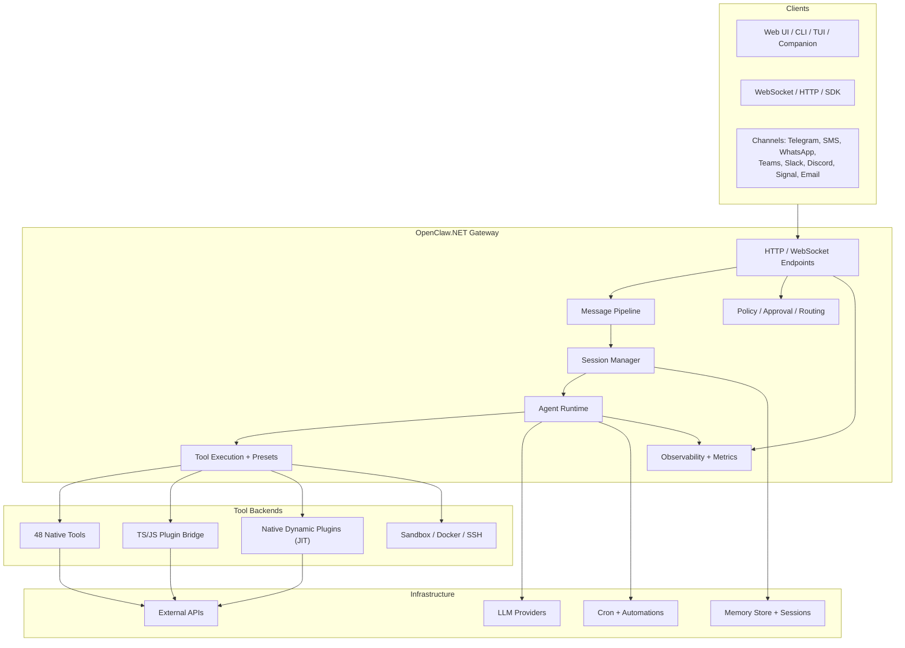
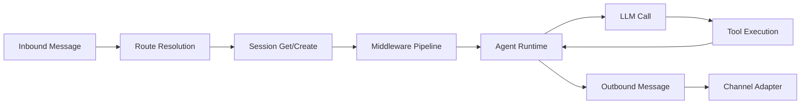

<div align="center">
  
</div>

# OpenClaw.NET

[](https://opensource.org/licenses/MIT)


> **Disclaimer**: This project is not affiliated with, endorsed by, or associated with [OpenClaw](https://github.com/openclaw/openclaw). It is an independent .NET implementation inspired by their work.

Self-hosted **AI agent runtime and gateway for .NET** with 48 native tools, 9 channel adapters, multi-agent routing, review-first self-evolving features, built-in OpenAI/Claude/Gemini provider support, built-in tool presets, NativeAOT support, and practical OpenClaw ecosystem compatibility.

## Why This Project Exists

Most agent stacks assume Python- or Node-first runtimes. That works until you want to keep the rest of your system in .NET, publish lean self-contained binaries, or reuse existing tools and plugins without rebuilding your runtime around another language stack.

OpenClaw.NET takes a different path:

- **NativeAOT-friendly runtime and gateway** for .NET agent workloads
- **Practical reuse of existing OpenClaw TS/JS plugins and `SKILL.md` packages** — install directly with `openclaw plugins install`
- A real **tool execution layer** with approval hooks, timeout handling, usage tracking, and optional sandbox routing
- **48 native tools** covering file ops, sessions, memory, web search, messaging, home automation, databases, email, calendar, and more
- **9 channel adapters** (Telegram, SMS, WhatsApp, Teams, Slack, Discord, Signal, email, webhooks) with DM policy, allowlists, and signature validation
- **Native LLM providers out of the box** for **OpenAI**, **Claude / Anthropic**, and **Gemini**, plus Azure OpenAI, Ollama, and OpenAI-compatible endpoints
- **Review-first self-evolving workflows** that can propose profile updates, automation drafts, and skill drafts from repeated successful sessions
- A foundation for **production-oriented agent infrastructure in .NET**

If this repo is useful to you, please star it.

## Key Features

### Agent Runtime
- Multi-step execution with tool calling, retries, per-call timeouts, streaming, and circuit-breaker behavior
- Context compaction (`/compact` command or automatic) with LLM-powered summarization
- Configurable reasoning effort (`/think off|low|medium|high`)
- Delegated sub-agents with configurable profiles, tool restrictions, and depth limits
- Multi-agent routing — route channels/senders with per-route model, prompt, tool preset, and tool allowlist overrides
- Persistent session search, user profiles, and session-scoped todo state available to the agent and operators

### Built-In Providers

- **OpenAI** via `Provider: "openai"`
- **Claude / Anthropic** via `Provider: "anthropic"` or `Provider: "claude"`
- **Gemini** via `Provider: "gemini"` or `Provider: "google"`
- **Azure OpenAI** via `Provider: "azure-openai"`
- **Ollama** via `Provider: "ollama"`
- **OpenAI-compatible** endpoints via `Provider: "openai-compatible"`, `groq`, `together`, or `lmstudio`

OpenClaw registers OpenAI, Claude, and Gemini natively at startup, so a fresh install only needs a provider id, model, and API key to get going.

### Review-First Learning

- The runtime can observe completed sessions and create **pending learning proposals** instead of auto-mutating behavior
- Proposal kinds include **`profile_update`**, **`automation_suggestion`**, and **`skill_draft`**
- Approving a proposal can update a user profile, create a disabled automation draft, or write a managed skill draft and reload skills
- Rejections, approvals, and source-session references are preserved so operators can audit what the system learned and why
- Learning proposals are available over the admin API, `OpenClaw.Client`, and the TUI review flow

### Memory, Profiles, and Automation

- **Session search** spans persisted conversation content for recall and operator lookup
- **User profiles** store stable facts, preferences, projects, tone, and recent intent, with native `profile_read` / `profile_write` tools
- **Automations** support list/get/preview/create/update/pause/resume/run flows and integrate with cron-backed delivery
- **Todos** are persisted per session and available through the native `todo` tool and operator surfaces

### 48 Native Tools

| Category | Tools |
|----------|-------|
| **File & Code** | `shell`, `read_file`, `write_file`, `edit_file`, `apply_patch`, `process`, `git`, `code_exec`, `browser` |
| **Sessions** | `sessions`, `sessions_history`, `sessions_send`, `sessions_spawn`, `sessions_yield`, `session_status`, `session_search`, `agents_list` |
| **Memory** | `memory`, `memory_search`, `memory_get`, `project_memory` |
| **Web & Data** | `web_search`, `web_fetch`, `x_search`, `pdf_read`, `database` |
| **Communication** | `message`, `email`, `inbox_zero`, `calendar` |
| **Home & IoT** | `home_assistant`, `home_assistant_write`, `mqtt`, `mqtt_publish` |
| **Productivity** | `notion`, `notion_write`, `todo`, `automation`, `cron`, `delegate_agent` |
| **Media & AI** | `image_gen`, `vision_analyze`, `text_to_speech` |
| **System** | `gateway`, `profile_read`, `profile_write` |

### Tool Presets & Groups

Named presets control which tools are available per surface:

| Preset | Description |
|--------|-------------|
| `full` | All tools, no restrictions |
| `coding` | File I/O, shell, git, code execution, browser, memory, sessions |
| `messaging` | Message, sessions, memory, profiles, todo |
| `minimal` | `session_status` only |
| `web` / `telegram` / `automation` / `readonly` | Channel-specific defaults |

Presets compose from reusable **tool groups**: `group:runtime`, `group:fs`, `group:sessions`, `group:memory`, `group:web`, `group:automation`, `group:messaging`.

### 9 Channel Adapters

| Channel | Transport | Features |
|---------|-----------|----------|
| **Telegram** | Webhook | Media markers, photo upload, signature validation |
| **Twilio SMS** | Webhook | Rate limiting, opt-out handling |
| **WhatsApp** | Webhook / Bridge | Official Cloud API + Baileys bridge, typing indicators, read receipts |
| **Teams** | Bot Framework | JWT validation, conversation references, group/DM policy |
| **Slack** | Events API | Thread-to-session mapping, slash commands, HMAC-SHA256, mrkdwn conversion |
| **Discord** | Gateway WebSocket | Persistent connection, slash commands, Ed25519 interaction webhook, rate limiting |
| **Signal** | signald / signal-cli | Unix socket or subprocess bridge, privacy mode (no-content logging) |
| **Email** | IMAP/SMTP | MailKit-based |
| **Webhooks** | HTTP POST | Generic webhook triggers with HMAC validation |

All channels support DM policy (`open` / `pairing` / `closed`), sender allowlists, and deduplication.

### Skills

7 bundled skills: `daily-news-digest`, `data-analyst`, `deep-researcher`, `email-triage`, `homeassistant-operator`, `mqtt-operator`, `software-developer`.

Skills are loaded from workspace (`skills/`), global (`~/.openclaw/skills/`), or plugins. Install from ClawHub with `openclaw clawhub install <slug>`.

### Chat Commands

| Command | Description |
|---------|-------------|
| `/status` | Session info (model, turns, tokens) |
| `/new` / `/reset` | Clear conversation history |
| `/model <name>` | Override LLM model for session |
| `/think off\|low\|medium\|high` | Set reasoning effort level |
| `/compact` | Trigger history compaction |
| `/verbose on\|off` | Show tool calls and token usage per turn |
| `/usage` | Show total token counts |
| `/help` | List commands |

### Plugin System

Install community plugins directly from npm/ClawHub:

```bash
openclaw plugins install @sliverp/qqbot
openclaw plugins install @opik/opik-openclaw
openclaw plugins list
openclaw plugins search openclaw dingtalk
```

Supports JS/TS bridge plugins, native dynamic .NET plugins (`jit` mode), and standalone `SKILL.md` packages. See [Plugin Compatibility Guide](docs/COMPATIBILITY.md).

### Integrations

| Integration | Description |
|-------------|-------------|
| **Tailscale Serve/Funnel** | Zero-config remote access via Tailscale |
| **Gmail Pub/Sub** | Email event triggers via Google Pub/Sub push notifications |
| **mDNS/Bonjour** | Local network service discovery |
| **Semantic Kernel** | Host SK tools/agents behind the gateway |
| **MAF Orchestrator** | Microsoft Agent Framework backend (optional) |
| **MCP** | Model Context Protocol facade for tools, resources, prompts |

## Architecture



### Runtime flow



### Runtime modes

| Mode | Description |
|------|-------------|
| `aot` | Trim-safe, low-memory lane. Native tools and bridge plugins only. |
| `jit` | Full plugin surfaces: channels, commands, providers, dynamic .NET plugins. |
| `auto` | Selects `jit` when dynamic code is available, `aot` otherwise. |

## Quickstart

```bash
git clone https://github.com/clawdotnet/openclaw.net
cd openclaw.net

export OpenClaw__Llm__Provider="openai"   # or: anthropic / claude / gemini
export OpenClaw__Llm__Model="gpt-4.1"
export MODEL_PROVIDER_KEY="your-api-key"

# Validate config (optional)
dotnet run --project src/OpenClaw.Gateway -c Release -- --doctor

# Start the gateway
dotnet run --project src/OpenClaw.Gateway -c Release
```

Then open one of:

| Surface | URL |
|---------|-----|
| Web UI / Live Chat | `http://127.0.0.1:18789/chat` |
| WebSocket | `ws://127.0.0.1:18789/ws` |
| Live WebSocket | `ws://127.0.0.1:18789/ws/live` |
| Integration API | `http://127.0.0.1:18789/api/integration/status` |
| MCP endpoint | `http://127.0.0.1:18789/mcp` |
| OpenAI-compatible | `http://127.0.0.1:18789/v1/responses` |

**Other entry points:**

```bash
# CLI chat
dotnet run --project src/OpenClaw.Cli -c Release -- chat

# CLI live session
dotnet run --project src/OpenClaw.Cli -c Release -- live --provider gemini

# One-shot CLI run
dotnet run --project src/OpenClaw.Cli -c Release -- run "summarize this README" --file ./README.md

# Install a plugin
dotnet run --project src/OpenClaw.Cli -c Release -- plugins install @sliverp/qqbot

# Desktop companion (Avalonia)
dotnet run --project src/OpenClaw.Companion -c Release

# Terminal UI
dotnet run --project src/OpenClaw.Cli -c Release -- tui
```

**Key environment variables:**

| Variable | Default | Purpose |
|----------|---------|---------|
| `MODEL_PROVIDER_KEY` | — | LLM provider API key |
| `OpenClaw__Llm__Provider` | `openai` | Built-in provider id (`openai`, `anthropic`, `claude`, `gemini`, `google`, `azure-openai`, `ollama`) |
| `OpenClaw__Llm__Model` | provider-specific | Default model id for the selected provider |
| `OPENCLAW_WORKSPACE` | — | Workspace directory for file tools |
| `OPENCLAW_AUTH_TOKEN` | — | Auth token (required for non-loopback) |
| `OpenClaw__Runtime__Mode` | `auto` | Runtime lane (`aot`, `jit`, or `auto`) |

**Common provider examples:**

```bash
# OpenAI
export OpenClaw__Llm__Provider="openai"
export OpenClaw__Llm__Model="gpt-4.1"
export MODEL_PROVIDER_KEY="sk-..."

# Claude
export OpenClaw__Llm__Provider="claude"
export OpenClaw__Llm__Model="claude-sonnet-4-5"
export MODEL_PROVIDER_KEY="sk-ant-..."

# Gemini
export OpenClaw__Llm__Provider="gemini"
export OpenClaw__Llm__Model="gemini-2.5-flash"
export MODEL_PROVIDER_KEY="AIza..."
```

See the full [Quickstart Guide](docs/QUICKSTART.md) for deployment notes.

## Docker Deployment

```bash
export MODEL_PROVIDER_KEY="sk-..."
export OPENCLAW_AUTH_TOKEN="$(openssl rand -hex 32)"

# Gateway only
docker compose up -d openclaw

# With automatic TLS via Caddy
export OPENCLAW_DOMAIN="openclaw.example.com"
docker compose --profile with-tls up -d
```

### Published images

- `ghcr.io/clawdotnet/openclaw.net:latest`
- `tellikoroma/openclaw.net:latest`
- `public.ecr.aws/u6i5b9b7/openclaw.net:latest`

| Volume | Purpose |
|--------|---------|
| `/app/memory` | Session history + memory notes (persist across restarts) |
| `/app/workspace` | Mounted workspace for file tools (optional) |

See [Docker Image Notes](docs/DOCKERHUB.md) for details.

## Security and Hardening

When binding to a non-loopback address, the gateway **refuses to start** unless dangerous settings are explicitly hardened:

- Auth token **required** for non-loopback binds
- Wildcard tooling roots, shell access, and plugin execution blocked by default
- Webhook signature validation enforced (Slack HMAC-SHA256, Discord Ed25519, WhatsApp X-Hub-Signature-256)
- `raw:` secret refs rejected on public binds
- DM policy enforcement per channel (`open`, `pairing`, `closed`)
- Rate limiting per-IP, per-connection, and per-session

See [Security Guide](SECURITY.md) for full hardening guidance and [Sandboxing Guide](docs/sandboxing.md) for sandbox routing.

## Observability

| Endpoint | Description |
|----------|-------------|
| `GET /health` | Health check |
| `GET /metrics` | Runtime counters (requests, tokens, tool calls, circuit breaker) |
| `GET /memory/retention/status` | Retention config + last sweep |
| `POST /memory/retention/sweep` | Manual retention sweep (`?dryRun=true`) |

All operations emit structured logs and `.NET Activity` traces with correlation IDs, exportable to OTLP collectors.

## Docs

| Document | Description |
|----------|-------------|
| [Quickstart Guide](docs/QUICKSTART.md) | Local setup and first usage |
| [User Guide](docs/USER_GUIDE.md) | Runtime concepts, providers, tools, skills, memory, channels |
| [Tool Guide](docs/TOOLS_GUIDE.md) | Built-in tools, native integrations, approval guidance |
| [Plugin Compatibility Guide](docs/COMPATIBILITY.md) | Plugin surfaces, mode gating, failure modes |
| [Security Guide](SECURITY.md) | Hardening guidance for public deployments |
| [Sandboxing Guide](docs/sandboxing.md) | Sandbox routing, build flags, config |
| [Semantic Kernel Guide](docs/SEMANTIC_KERNEL.md) | Hosting SK tools/agents behind OpenClaw.NET |
| [WhatsApp Setup](docs/WHATSAPP_SETUP.md) | Worker setup and auth flow |
| [Docker Image Notes](docs/DOCKERHUB.md) | Container usage and image references |
| [Changelog](CHANGELOG.md) | Tracked project changes |

## CI/CD

GitHub Actions (`.github/workflows/ci.yml`):
- **On push/PR to main**: build + test standard and MAF-enabled targets
- **On push to main**: publish gateway artifacts (`standard-{jit|aot}`, `maf-enabled-{jit|aot}`), NativeAOT CLI, and Docker image to GHCR

## Contributing

Looking for:

- Security review and penetration testing
- NativeAOT trimming improvements
- Tool sandboxing and isolation ideas
- New channel adapters and integrations
- Performance benchmarks

If this aligns with your interests, open an issue. If this project helps your .NET AI work, consider starring it.
